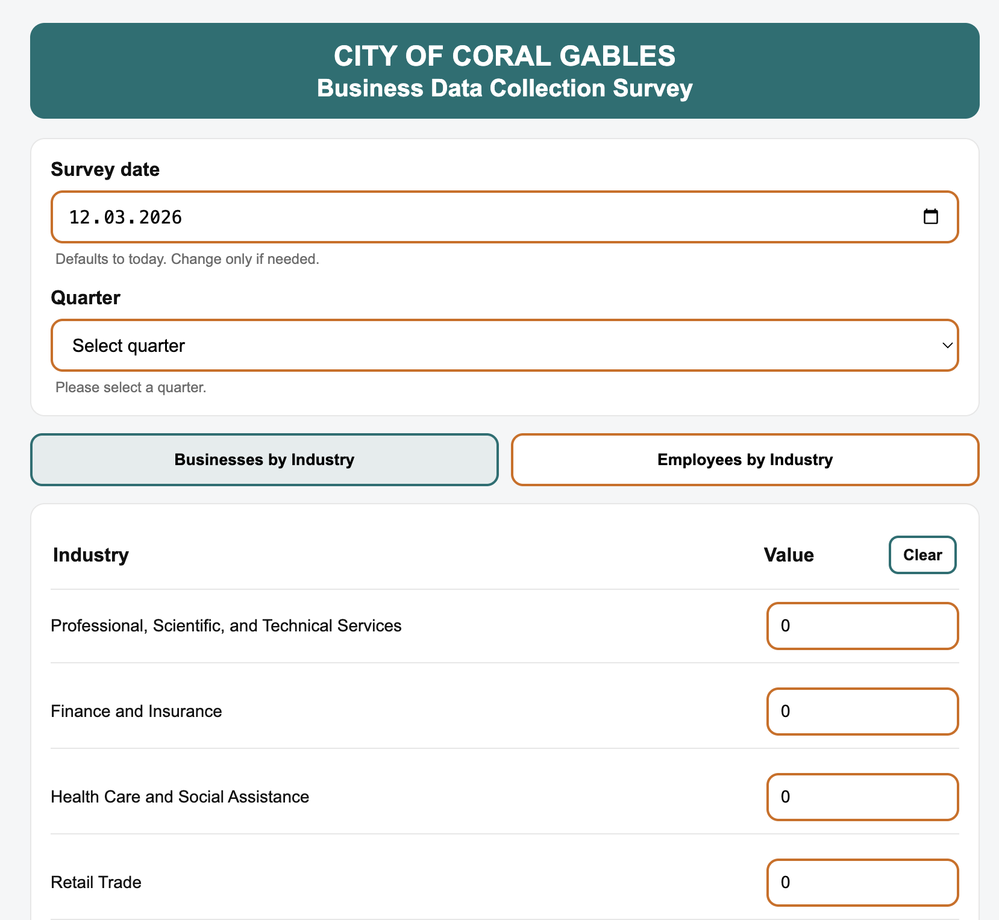
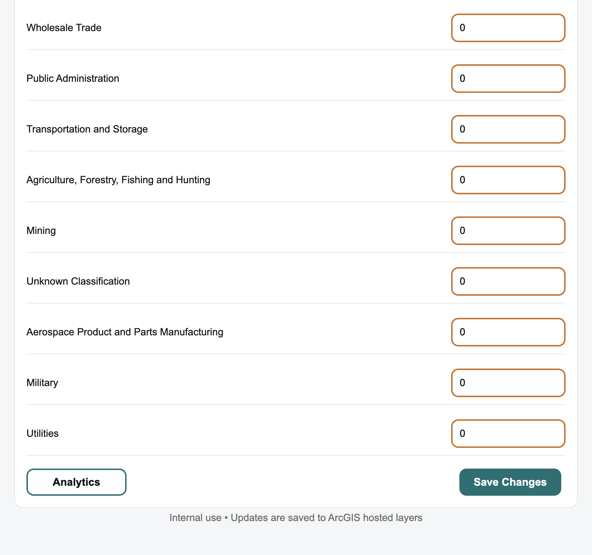
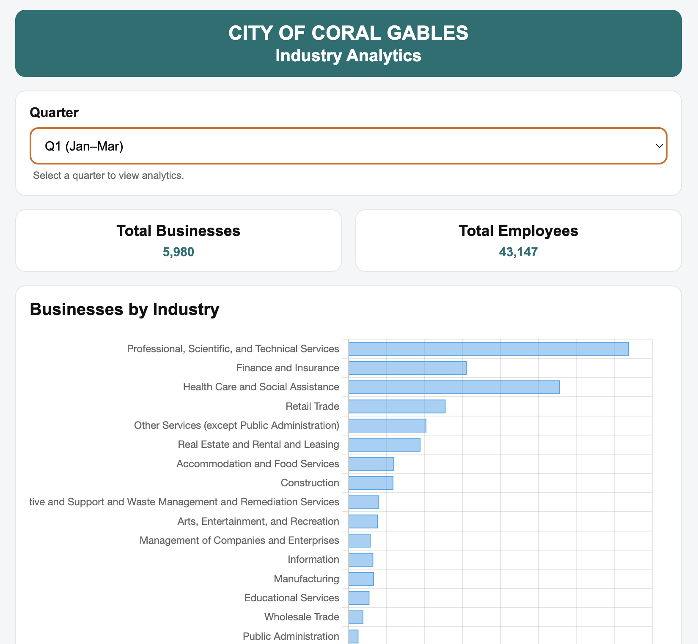
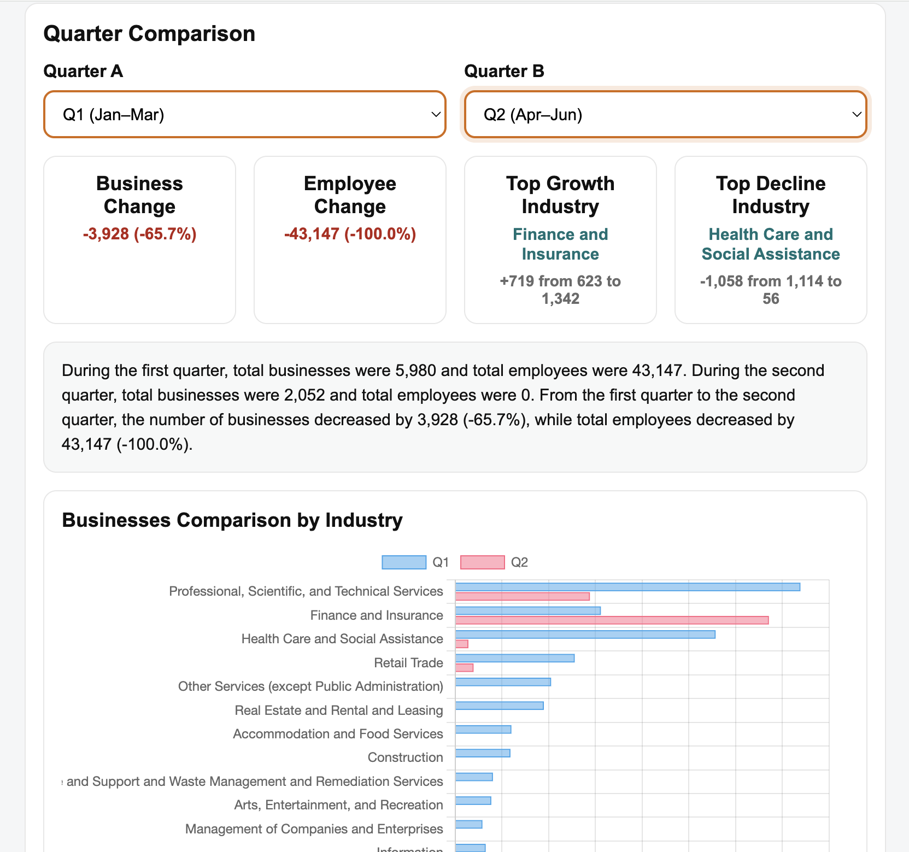

# Business Data Collection Survey

A web-based survey and analytics application developed for the **City of Coral Gables** to collect, store, and analyze quarterly business and employment data across multiple industries.

This internal tool allows users to enter survey data, save it directly to **ArcGIS hosted feature layers**, and view analytics dashboards that show trends, totals, and quarter-to-quarter comparisons.

---

## Overview

The **Business Data Collection Survey** is an internal web application built to simplify the process of collecting and analyzing economic data for the City of Coral Gables.

The application allows city staff to:

- Enter **business counts by industry**
- Enter **employee counts by industry**
- Store the collected data in **ArcGIS hosted layers**
- View analytics dashboards with charts and quarter comparisons

The system supports quarterly reporting and helps monitor changes in business activity and employment across industries in the city.

---

## Features

### Survey Page

The survey page allows users to collect quarterly business and employment data.

Users can:

- Select a **survey date**
- Select a **quarter**
- Switch between **Businesses by Industry** and **Employees by Industry**
- Enter values for each industry category
- Clear values using the **Clear** button
- Save updates to **ArcGIS hosted feature layers**
- Open the **Analytics dashboard**

---

## Screenshots

### Survey Page

The main survey interface where users enter quarterly business and employee data by industry.



---

### Survey Page – Bottom Section

The bottom section of the survey page where users can clear values, open analytics, or save changes to ArcGIS hosted layers.



---

### Analytics Dashboard

The analytics page displays totals and visual charts showing the distribution of businesses and employees across industries for the selected quarter.



---

### Quarter Comparison Analytics

Users can compare two quarters to analyze changes in businesses and employees, identify industry growth or decline, and view comparison charts.



---

## Data Validation

The survey includes validation rules to maintain data quality.

Rules include:

- Only **whole numbers** are allowed
- **Negative numbers** are not allowed
- **Decimal values** are not allowed
- **Leading zeros** are not allowed (except `0`)
- Blank edited fields cannot be saved

If invalid values are detected, the system highlights the input fields and prevents saving until the errors are corrected.

---

## ArcGIS Integration

The application connects to **ArcGIS hosted feature layers** to store and retrieve quarterly data.

Two layers are used:

- **Business by Industry**
- **Employees by Industry**

ArcGIS REST operations used:

- `query` – retrieve records by quarter  
- `applyEdits` – update records with survey results  

This allows the system to function as both a **data collection interface** and an **analytics dashboard**.

---

## Tech Stack

**Frontend**

- HTML5
- CSS3
- JavaScript (Vanilla JS)

**Visualization**

- Chart.js

**Data Storage**

- ArcGIS Hosted Feature Layers
- ArcGIS REST API

---

## Project Structure

```text
Business-Data-Collection-Survey
│
├── index.html
├── app.js
├── analytics.html
├── analytics.js
├── styles.css
│
├── screenshots
│   ├── 1.png
│   ├── 2.png
│   ├── 3.png
│   └── 4.png
│
└── README.md
```

---

## How the Application Works

### 1. Data Entry

Users open the survey page and:

1. Select a survey date  
2. Select a quarter  
3. Enter industry values  
4. Save the data  

### 2. Data Storage

When users save data, the application sends updates to ArcGIS using:

```
applyEdits
```

Only the fields edited by the user are updated.

### 3. Analytics

The analytics page retrieves data from ArcGIS using:

```
query
```

The system then calculates totals, builds charts, and generates comparison summaries.

---

## Current Functionality

The application currently supports:

- Quarterly survey data entry
- Business tracking by industry
- Employee tracking by industry
- ArcGIS data integration
- Data validation before saving
- Analytics dashboards
- Quarter comparison analysis
- Growth and decline insights by industry

---

## Future Improvements

Possible future improvements include:

- Mobile layout improvements
- Exportable analytics reports
- Additional filtering options
- Authentication for internal users
- Enhanced dashboard visualizations

---

## Notes

- This application is intended for **internal use**
- All updates are saved to **ArcGIS hosted feature layers**
- Additional improvements may be implemented after project review

---

## Author

Developed as a data collection and analytics solution for the **City of Coral Gables**.
